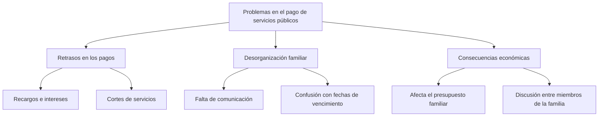

**JUAN PABLO CUELLAR OVALLE**

# CONTEXTO PROBLEMÁTICA
En muchas familias se presentan dificultades a la hora de pagar los servicios públicos. 
Esto pasa porque no hay un control claro de las fechas de vencimiento, cada persona tiene 
sus propias responsabilidades y a veces se confunden los recibos o simplemente se olvidan 
los pagos. Como consecuencia, se generan recargos, cortes de servicio y discusiones dentro 
del hogar. Todo esto afecta la economía familiar y también la convivencia.

# ÁRBOL DE PROBLEMAS

# PROMPT
La problemática se puede resolver a través de herramientas digitales que ayuden a las 
familias a organizar y centralizar los pagos de sus servicios públicos. Estas soluciones 
buscan facilitar la comunicación, recordar los vencimientos y evitar recargos innecesarios.

Las tres soluciones planteadas son:
1. Una aplicación móvil que envíe recordatorios automáticos de los pagos pendientes.  
2. Un calendario inteligente compartido entre los miembros de la familia con notificaciones.  
3. Una aplicación que centralice todos los servicios en un solo lugar para realizar los pagos fácilmente.  

# IDEA SELECCIONADA
Decidí quedarme con la aplicación que centraliza los pagos de los servicios públicos en un 
solo lugar, porque es la que más se ajusta a la problemática. Es más práctica que las otras 
dos ideas, ayuda a evitar confusiones y permite tener todo organizado en un mismo espacio, 
lo cual facilita que la familia pueda cumplir con los pagos a tiempo sin complicarse tanto.
